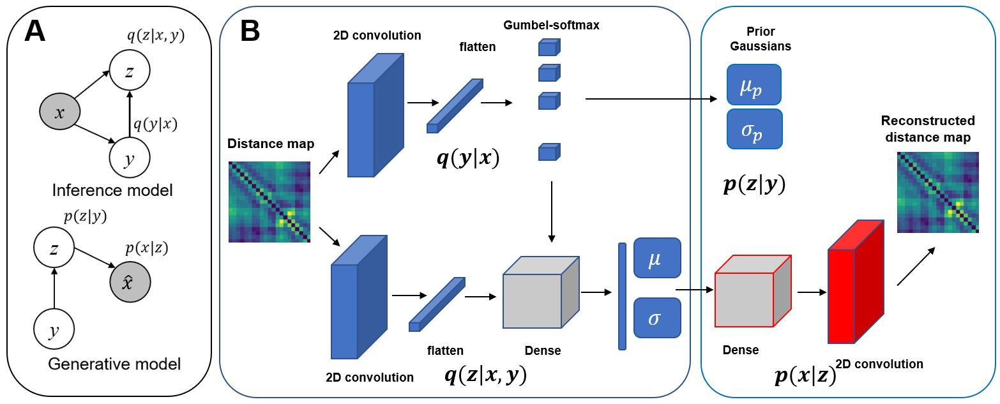

# The code for gaussian mixture variational auto-encoder using convolutional layers and a gumbel-softmax distribution for the application of clustering protein folding trajectories.

The code is mostly modified from the following source:

https://github.com/jariasf/GMVAE

https://github.com/psanch21/VAE-GMVAE

if you use this code please cite the following paper:

`
@article{ghorbani2021variational,
  title={Variational embedding of protein folding simulations using Gaussian mixture variational autoencoders},
  author={Ghorbani, Mahdi and Prasad, Samarjeet and Klauda, Jeffery B and Brooks, Bernard R},
  journal={The Journal of Chemical Physics},
  volume={155},
  number={19},
  pages={194108},
  year={2021},
  publisher={AIP Publishing LLC}
}
`
